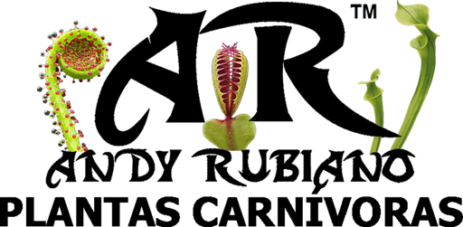

<div align="center">
    
</div>

# ¿Qué carnívora es? Identificador de plantas carnívoras por género con Teachable Machine, desplegado en la nube e integrado en una aplicación web

## 📋 Información General

| Aspecto | Detalles |
|--------|----------|
| **Autor** | Andrés Giovanny Rubiano Muñoz "Andy Rubiano" |
| **Correo** | arubiano67@unisalle.edu.co |
| **Asignatura** | Visión por Computador |
| **Docente** | Carlos Alejandro Espejo Villarraga |
| **Actividad** | Actividad 6 · Proyecto Final – Implementemos un modelo de clasificación |
| **Programa** | Maestría en Inteligencia Artificial |
| **Universidad** | Universidad de La Salle |
| **Entregable** | Modelo en la nube + aplicación web + scripts de preparación y evaluación (el informe está en `../computer vision-classification-model-report`) |
| **Año** | 2026 |

---

## 🎯 Descripción

Este repositorio contiene el **proyecto** del informe: los scripts que preparan el dataset, la aplicación web que consume el modelo y los scripts que lo evalúan. El modelo identifica el **género** de una planta carnívora a partir de una foto, entre siete géneros (*Dionaea*, *Drosera*, *Sarracenia*, *Nepenthes*, *Darlingtonia*, *Heliamphora* y *Pinguicula*) más una clase *No carnivora*, y fue entrenado en **Teachable Machine** con fotografías propias y de la comunidad del canal de YouTube **Andy Rubiano - Plantas carnívoras**. La aplicación responde el género, su confianza, la segunda opción y la **ficha de cuidados**, y cuando la confianza es baja dice "no estoy seguro".

| Recurso | Enlace |
|---|---|
| **Video demostrativo (YouTube, no listado)** | *pendiente* |
| **Repositorio en GitHub** | https://github.com/RubianoAndy/computer-vision-classification-model |
| **Aplicación publicada (GitHub Pages)** | https://rubianoandy.github.io/computer-vision-classification-model/ |
| **Modelo en la nube (endpoint)** | https://teachablemachine.withgoogle.com/models/RmIb0tr6_/ |
| **Canal de YouTube** | https://www.youtube.com/@RubianoAndy |
| **Herramienta** | [Teachable Machine](https://teachablemachine.withgoogle.com/) |
| **Informe** | `../computer vision-classification-model-report/build/main.pdf` |

> ℹ️ **Por qué la inferencia ocurre en el navegador.** El endpoint de Teachable Machine no es una API de predicción sino un servidor de archivos estáticos: entrega `model.json`, `model.weights.bin` y `metadata.json`, y quien los descarga ejecuta el modelo con TensorFlow.js. No hay costo por consulta y las fotografías nunca salen del dispositivo del usuario.

---

## 🧪 Proceso

### 1 · Dataset propio

1.200 fotografías, **150 por clase**, reunidas en octubre de 2026:

| Fuente | Clases | Detalle |
|---|---|---|
| Fotos propias del autor | 7 géneros | Archivo del canal (598 fotos revisadas, 335 útiles) |
| Comunidad de plantas carnívoras y suscriptores del canal | 7 géneros | Fotos compartidas por mensajes directos y grupos de subastas (1.000 fotos revisadas, 343 útiles) |
| iNaturalist (licencias CC BY, CC BY-NC, CC BY-SA, CC BY-NC-SA) | *No carnivora* | 136 observaciones de 32 taxones que se parecen a una carnívora (suculentas en roseta, calas, bromelias, musgo…) más 14 fotos propias sin plantas carnívoras |

Cada foto se revisó a mano: se descartaron las plantas muy pequeñas o lejanas, las flores y esquejes sin trampas, las borrosas, las duplicadas (dHash) y las de géneros fuera del alcance (*Cephalotus*, *Utricularia*…). Luego se renombraron a `<clase>_<nnn>.jpg` conservando en un CSV la fuente y el **grupo de ejemplar** de cada una.

### 2 · Preparación y partición

`utils/scripts/prepare-dataset.py` recorta cada imagen a cuadrado de 512 px eligiendo la ventana con más detalle sobre el lado largo (para no cortar la boca de las jarras altas) y separa **120 de entrenamiento y 30 de prueba por clase**. Las fotos de una misma serie o planta van completas a un solo lado, así que ninguna imagen de prueba tiene una casi idéntica en entrenamiento. Semilla fija (42).

### 3 · Entrenamiento en Teachable Machine

Proyecto de imagen con las ocho clases y 120 imágenes cada una, hiperparámetros por defecto: 50 épocas, lote de 16 y tasa de aprendizaje de 0,001. La herramienta aparta el 15 % de cada clase como prueba interna (18 imágenes por clase).

### 4 · Despliegue en la nube

*Exportar modelo → TensorFlow.js → Subir (enlace para compartir)*. La plataforma aloja el modelo y devuelve la URL del endpoint. La copia descargada (`utils/models/tm-carnivoras-model.zip`, 2,1 MiB) produce **exactamente las mismas probabilidades** que la versión publicada (diferencia máxima 0,0 sobre las 240 imágenes de prueba).

### 5 · Aplicación web

HTML + CSS + JavaScript sin *framework*, con `@teachablemachine/image` y TensorFlow.js desde CDN, e identidad visual de *Andy Rubiano - Plantas carnívoras*. Tres modos:

| Modo | Qué hace |
|---|---|
| **Una imagen** | Arrastrar o elegir una foto (o probar con una de muestra); muestra el género, su nombre común y tipo de trampa, la confianza, la segunda opción, las ocho probabilidades y la **ficha de cuidados** con enlace al canal |
| **Conjunto de imágenes** | Cargar una carpeta completa; si las subcarpetas o los nombres de archivo traen la clase, calcula exactitud, precisión, exhaustividad, F1 y la matriz de confusión 8×8 en vivo, y exporta un CSV |
| **Cámara** | Identificación en tiempo real desde la webcam |

Los tres modos comparten el **umbral de confianza** (0,8): si la clase ganadora no lo alcanza, la respuesta es "no estoy seguro" con las dos opciones más probables. En el modo *Conjunto* las imágenes sin responder no cuentan como acierto ni como error, y al cambiar el interruptor las métricas se recalculan sin volver a ejecutar el modelo.

### 6 · Evaluación fuera de la herramienta

`utils/eval/model-inference.js` carga el modelo **directamente desde el endpoint** en Node.js, repite el preprocesamiento de la plataforma (recorte central, 224 × 224, rango [-1, 1]) y escribe un CSV con las probabilidades; `utils/eval/model-evaluation.py` calcula las métricas multiclase con scikit-learn y dibuja las figuras del informe.

---

## 📊 Resultados

### Lo que reporta Teachable Machine (prueba interna, 18 imágenes por clase)

Exactitud interna ≈ 0,85. Por clase: Pinguicula 1,00 · Drosera 0,94 · Darlingtonia 0,94 · Heliamphora 0,89 · Dionaea 0,83 · Nepenthes 0,83 · Sarracenia 0,78 · No carnivora 0,61. Capturas y JSON en `utils/teachable-machine/`.

### Evaluación sobre el segmento independiente (240 imágenes, 30 por clase)

| Métrica | Valor | IC 95 % (bootstrap) |
|---|---|---|
| **Exactitud** | **0,879** | [0,837; 0,921] |
| Exactitud top-2 | 0,958 | |
| F1 macro | 0,878 | [0,831; 0,917] |
| AUC macro (uno contra el resto) | 0,988 | [0,982; 0,994] |
| Pérdida logarítmica | 0,526 | |

| Clase | Precisión | Exhaustividad | F1 | AUC |
|---|---|---|---|---|
| Dionaea | 0,871 | 0,900 | 0,885 | 0,988 |
| Drosera | 0,933 | 0,933 | 0,933 | 0,996 |
| Sarracenia | 0,880 | 0,733 | 0,800 | 0,979 |
| Nepenthes | 0,963 | 0,867 | 0,912 | 0,995 |
| Darlingtonia | 0,882 | 1,000 | 0,938 | 0,999 |
| Heliamphora | 0,839 | 0,867 | 0,852 | 0,987 |
| Pinguicula | 0,806 | 0,833 | 0,820 | 0,976 |
| No carnivora | 0,871 | 0,900 | 0,885 | 0,988 |

- **Dónde se equivoca (29 errores):** entre géneros de jarra parecidos (*Sarracenia* → *Heliamphora* 3, → *Darlingtonia* 2; *Nepenthes* → *Sarracenia* 3) y entre rosetas (*Pinguicula* → *No carnivora* 3, → *Dionaea* 2; *Dionaea* → *Pinguicula* 2).
- **Confianza:** 0,955 en los aciertos frente a 0,829 en los errores; el modelo duda más cuando se equivoca. Con el **umbral de confianza de 0,8** responde el 89 % de las imágenes con exactitud de 0,906 y evita 9 de los 29 errores.
- **Interna vs. independiente:** la prueba interna de 18 imágenes por clase daba 0,61 en *No carnivora*; con 30 imágenes nuevas esa clase llega a 0,90. Las muestras pequeñas engañan.
- **Nube = local = app:** la copia descargada da las mismas probabilidades que el endpoint; la app, cargando la carpeta de prueba, reporta 88,3 % sin umbral (212 de 240) frente a 87,9 % del script, y 93,3 % con umbral sobre el 87 % de imágenes que responde.

Las figuras (matriz de confusión 8×8, curvas ROC por clase, barras por clase, histograma de confianza, curva umbral/cobertura y galería de errores) se generan en `../computer vision-classification-model-report/assets/images/results/`.

---

## 📚 Estructura del Repositorio

La raíz está organizada para publicarse tal cual en **GitHub Pages**: `index.html` es la página, `src/` y `assets/` la alimentan, y todo lo que no forma parte de la aplicación vive en `utils/`.

```
.
├── index.html                        # La aplicación web: una imagen · conjunto de imágenes · cámara
├── README.md                         # Este archivo
├── .nojekyll                         # GitHub Pages sirve los archivos tal cual
├── .gitignore
├── src/                              # Lo que alimenta a index.html
│   ├── styles.css                    # Identidad Andy Rubiano - Plantas carnívoras (negro, blanco, verde)
│   ├── app.js                        # Carga del modelo, inferencia, umbral, fichas, métricas en vivo, CSV
│   └── config.js                     # MODEL_URL, umbral de confianza, redes y ficha de cada clase
├── assets/images/
│   ├── logo/                         # Logos originales (texto negro y texto blanco)
│   ├── logo-{dark,light}-{512,160,64}.png   # Versiones para la web y favicon
│   └── samples/                      # Ocho fotos de muestra para probar la app
└── utils/                            # Todo lo que no es la aplicación
    ├── scripts/
    │   ├── download-non-carnivorous.py   # Descarga de iNaturalist con atribuciones (clase No carnivora)
    │   ├── rename-dataset.py             # <clase>_<nnn>.jpg y CSV con fuente y grupo de ejemplar
    │   └── prepare-dataset.py            # Recorte a cuadrado 512 px y partición 120/30 por grupo
    ├── eval/
    │   ├── package.json              # @tensorflow/tfjs · jpeg-js
    │   ├── model-inference.js        # Inferencia (nube o disco) → CSV de probabilidades
    │   ├── model-evaluation.py       # Métricas multiclase, ROC, AUC, bootstrap, umbral y figuras
    │   ├── error-gallery.py          # Galería de errores y pares de clases más confundidos
    │   ├── cloud-predictions.csv     # Probabilidades en prueba desde el endpoint (240 filas)
    │   ├── local-predictions.csv     # Mismas probabilidades con la copia descargada
    │   └── cloud-metrics.json        # Métricas, matriz de confusión, umbrales y lista de errores
    ├── models/
    │   ├── tm-carnivoras-model.zip   # Exportación TensorFlow.js descargada de Teachable Machine
    │   └── tm-carnivoras-model/      # model.json · weights.bin · metadata.json
    ├── postman/
    │   └── identificador-carnivoras.postman_collection.json   # APIs del modelo numeradas 01-04, con pruebas
    └── teachable-machine/
        ├── identificador-carnivoras.tm                   # Proyecto de TM con las 960 imágenes cargadas
        ├── identificador-carnivoras-metricas-internas.json
        └── identificador-carnivoras-mas-datos.png        # Panel "Más datos" (y la columna derecha de la matriz)
```

> ℹ️ **Colección de Postman.** `utils/postman/identificador-carnivoras.postman_collection.json` reúne las peticiones al endpoint del modelo: **01** `metadata.json` (ocho etiquetas y tamaño de entrada), **02** `model.json` (arquitectura y manifiesto de pesos), **03** `model.weights.bin` (263 tensores, 2.156.432 bytes) y **04** la redirección 302 del endpoint hacia Google Cloud Storage. Cada petición trae pruebas automáticas. Se importa con *Import → File*; también corre con `npx newman run utils/postman/identificador-carnivoras.postman_collection.json`.

> ℹ️ **Las imágenes no se versionan.** El dataset (`raw/` con 1.200 originales y `prepared/` con las versiones recortadas) vive fuera del repositorio, en `../dataset/`, junto con los CSV de fuentes, atribuciones y descartes. Las fotos de carnívoras son propias y de la comunidad del canal; las de *No carnivora* se descargan de iNaturalist con el script.

---

## ⚙️ Requisitos

| Componente | Dependencias |
|---|---|
| Scripts de Python (3.12) | `Pillow`, `numpy`, `pandas`, `scikit-learn`, `matplotlib`, `requests` |
| Evaluación en Node.js (18+) | `@tensorflow/tfjs`, `jpeg-js` (se instalan con `npm install` en `utils/eval/`) |
| Aplicación web | Cualquier navegador moderno y conexión a Internet para descargar el modelo desde el endpoint |

---

## 🛠️ Reproducción

### 1 · Dataset

Con las fotos crudas en `../dataset/raw/<clase>/`:

```bash
python utils/scripts/download-non-carnivorous.py   # solo la clase No carnivora (iNaturalist)
python utils/scripts/rename-dataset.py
python utils/scripts/prepare-dataset.py            # genera ../dataset/prepared/{train,test}
```

### 2 · Entrenamiento y despliegue

> 💡 **Atajo para reproducir el entrenamiento.** `utils/teachable-machine/identificador-carnivoras.tm` es el proyecto de Teachable Machine con las ocho clases y sus 120 imágenes ya cargadas. En la plataforma: menú ☰ → *Abrir el proyecto desde un archivo* → elegir el `.tm`, y queda listo para pulsar *Preparar modelo* (menos de un minuto con GPU). No requiere cuenta de Google.

1. En Teachable Machine, proyecto de imagen con las ocho clases y subir `../dataset/prepared/train/<clase>` (o abrir el `.tm` anterior).
2. *Preparar modelo* con los valores por defecto.
3. *Exportar modelo → TensorFlow.js → Subir (enlace para compartir)* y copiar la URL en `src/config.js` (`MODEL_URL`).
4. Opcional: *Descargar* para conservar una copia en `utils/models/`.

### 3 · Aplicación web

```bash
python -m http.server 8765
```

y abrir `http://localhost:8765/`. En GitHub Pages basta con publicar la rama: la raíz ya tiene `index.html` y `.nojekyll`.

### 4 · Evaluación

```bash
cd utils/eval && npm install
node model-inference.js "https://teachablemachine.withgoogle.com/models/RmIb0tr6_/" "../../../dataset/prepared/test" cloud-predictions.csv
node model-inference.js "../models/tm-carnivoras-model/" "../../../dataset/prepared/test" local-predictions.csv
python model-evaluation.py cloud-predictions.csv cloud
python error-gallery.py cloud-predictions.csv cloud
```

---

## 🙏 Créditos de las imágenes

Las imágenes de plantas carnívoras son fotografías propias del autor y fotografías aportadas por la comunidad de cultivadores de plantas carnívoras y por suscriptores del canal de YouTube **Andy Rubiano - Plantas carnívoras**. Las imágenes de la clase *No carnivora* provienen de iNaturalist bajo licencias Creative Commons; la atribución de cada una (autor, licencia y enlace a la observación) está en `../dataset/raw/_fuentes/no_carnivora_atribuciones.csv`.

| Red | Enlace |
|---|---|
| YouTube | https://www.youtube.com/@RubianoAndy |
| TikTok | https://www.tiktok.com/@RubianoAndy |
| Instagram | https://www.instagram.com/RubianoAndy |
| Facebook | https://www.facebook.com/RubianoAndy |
| LinkedIn | https://www.linkedin.com/company/andyrubiano |
